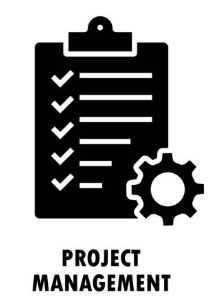

	
	<h1>Project Management Application</h1>

 **A full-stack, modular project management system built on the **Frappe Framework****

    <a href="https://one-korecent.frappe.cloud/app/build">Website</a>
    -
    <a href="https://drive.google.com/file/d/11l84TMWJiwHBId_ejRz6mBqPUEBi8qQo/view?usp=drivesdk">Demo Video</a>

 
 

This application helps organizations efficiently manage complex projects, track deliverables, and coordinate among internal teams, clients, and external vendors — all within a unified, collaborative interface.

---

## Overview

The Project Management App is designed to streamline project execution through structured planning, real-time collaboration, automated notifications, and comprehensive reporting. It includes client and vendor portals, advanced Gantt chart visualization, task assignment workflows, role-based access controls, and integrations with **Raven** for bot-powered messaging and notifications.

The app is best suited for teams working on milestone-driven projects with deliverables and dependencies across multiple stakeholders.

---

## Features

### Core Capabilities

- **Project & Task Management**
  - Create and configure multi-phase projects with defined timelines
  - Hierarchical task structuring using a tree-like architecture
  - Assign tasks to internal team members or external vendors

- **Deliverable Tracking**
  - Associate multiple tasks with a defined deliverable
  - Workflow to submit, review, accept, or request revisions on deliverables

- **Client & Vendor Collaboration**
  - Invite stakeholders without Desk access
  - Secure portals for monitoring progress, submitting deliverables, and providing feedback

- **Automated Workflows**
  - Notification system powered by **Raven bots**
  - Alerts for task assignment, status changes, missed deadlines, and more

- **Reporting System**
  - Scheduled reports for daily and weekly status
  - Time logs, task summaries, and project health indicators

- **Role-Based Dashboards**
  - Custom dashboards based on user type (Project Manager, Team Member, Client, Vendor)

---

## System Architecture

The system is built using **Frappe Framework**, leveraging its modular DocType system, REST APIs, and extensible front-end through **Frappe UI** and **Vue.js**.

- **Backend**: Python (Frappe Framework)
- **Frontend**: Vue.js with Frappe UI (for client and vendor portals)
- **Database**: MariaDB / PostgreSQL (configurable)
- **Communication**: Raven (Bot + Workspace Integration) $ Mail
- **Scheduler**: Frappe Background Jobs + Cron for reports and notifications (ongoing)

---

## Core Modules (DocTypes)

| DocType                    | Description                                                                 |
|---------------------------|-----------------------------------------------------------------------------|
| **Project**               | Stores overall project metadata like name, timeline, client, and documents. |
| **Task**                  | Represents individual units of work, often linked to a deliverable.         |
| **Deliverable**           | Major milestones or output expectations in the project lifecycle.           |
| **Deliverable Task**      | Child DocType under Deliverable listing associated tasks.                   |
| **Team Member**           | Tracks assigned members to a project with their roles.                      |
| **PM Client Invitation**  | Manages client invitations with tracking for acceptance and status.         |
| **PM Client Guest Access**| Enables restricted portal access to clients or vendors.                     |
| **Project Proposal**      | Captures proposals made before project approval and initiation.             |
| **Task Time Log**         | Logs effort/time spent by team members on specific tasks.                   |
---

## User Personas

### Project Manager (PM)
- Full access to create/manage projects and assign tasks
- Configure Raven bots for automated alerts
- Access project-level documents, feedback, and Gantt views
- Approve vendor deliverables and generate progress reports
- Dedicated workspace for internal project communication

### Project Team Member
- Access dashboard with assigned tasks and timelines
- Log time and update status
- Receive deadline and update notifications

### Client (External Portal)
- Access limited to assigned projects
- Track project progress and milestones
- View and approve/reject deliverables
- Submit comments or request changes
- Invite internal team members to monitor the project

### Vendor (External Portal)
- View assigned tasks
- Upload deliverables
- View and respond to feedback
- Modify deliverables until approved

---

## Project Lifecycle

1. **Project Creation**
   - PM defines project name, start/end dates, team members, deliverables, etc.
   
2. **Task Assignment**
   - Tasks are created in a hierarchy and assigned to members or vendors

3. **Deliverable Setup**
   - Deliverables are defined and linked with one or more tasks

4. **Notifications**
   - Assignees receive alerts from Raven when tasks are added or modified

5. **Client Feedback**
   - Clients review deliverables and provide feedback via portal

6. **Progress Tracking**
   - PM tracks progress using Gantt and reports

7. **Reports**
   - generate weekly summaries on time logs and status

---

## Raven Bot Integration

Raven is Integrated through a open channel button.

---

### Notification Triggers using Email

| Trigger | Notification |
|--------|--------------|
| Project Created | Message to all the Members and Client |
| Task Assigned | Message to Assignee |
| Task Status Updated | Alert to PM |
| Deliverable Sent for Approval | Alert to Client |
| Deliverable Submitted | Response to the Assigne |
| Feedback Added | Notification to assigned vendor/team |

---

## Client & Vendor Portals

Built using **Vue.js + Frappe UI**, the portals provide role-specific, secure dashboards.

### Client Portal
- Propose new projects
- Monitor real-time progress
- View deliverables and submit feedback
- Add internal viewers

### Vendor Portal
- View and manage assigned tasks
- Submit deliverables
- Update based on feedback
---

## Demo Screenshots

### New Project Creation

### Task in Progress

### Client Portal

### Project Proposal Web Page for New Project

### Vendor Portal

### Reports for Project Manager

---

## License

This project is licensed under the [MIT License](LICENSE).

---

## Contributing

We welcome contributions! Please fork the repository and create a pull request. For major changes, open an issue first to discuss what you would like to change.

---

## Contact

For questions, issues, or feature requests, please open a GitHub issue.

 

	<a href="https://frappe.io" target="_blank">
		<picture>
			<source media="(prefers-color-scheme: dark)" srcset="https://frappe.io/files/Frappe-white.png">
			
		</picture>
	</a>

